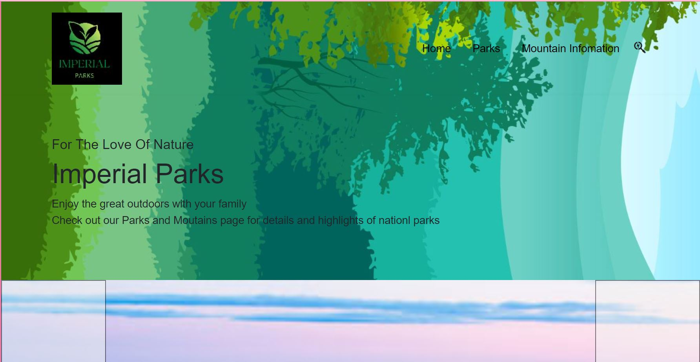
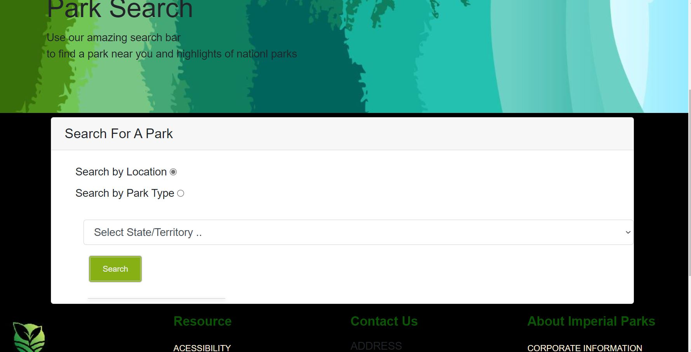
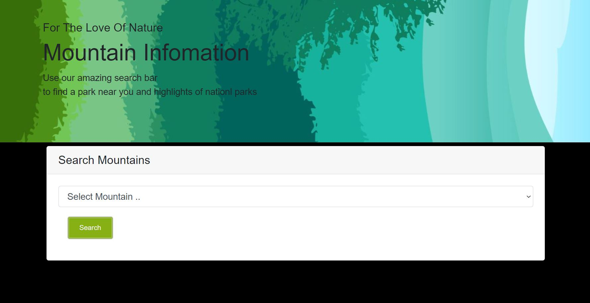

# CapstoneEnjoyOutdoors
A website to help users search and get information of parks and mountains. 
# Imperial Parks
## Imperial Parks provide a search engine to users
--------------------------
This website was constructed for a capstone project. The purpose is to show understanding of basic HTML, CSS and JavaScript language. 
Users search for parks within the U.S.A. with a filter. This provides two ways to search for a park; by parktype and location.
The main object is to programmatically upload the selected park or moutain into a div and have a list of parks or a mountained outputted. 
---
The pages include:
 * Homepage
 * Parks
 * Mountain Page 

This an interesting JavaScript that I wrote. This function allows me to create html elements as well as output for each park within the multiarray:
```
function displayparksinResults(inputParks) {
    let resultsOutput = document.getElementById("resultsOutput");
    resultsOutput.innerHTML = "";
    for (let park of inputParks) {

        let CardOutput = document.createElement("CardOutput");
        let CardOutputTitle = document.createElement("CardOutputTitle");
        let CardOutputText = document.createElement("CardOutputText");
        let btn = document.createElement('button');

        CardOutput.className = 'card'
        btn.id = 'send';
        btn.classList = 'btn-primary';
        CardOutputTitle.innerHTML = `<h7 <span class='fw-bold'> ${park.LocationName} </span></h7> `
        CardOutputText.innerHTML = `<h8 <span class='fw-bold'> <br> Address: ${park.Address} <br>  City: ${park.City} <br>  State: ${park.State}  <br> Zipcode: ${park.ZipCode}  <br> Phone: ${park.Phone} <br> FAX: ${park.Fax}  <br> </span></h8> `
        btn.innerHTML = `Visit Park`;
        btn.href = `${park.Visit}`;

        resultsOutput.appendChild(CardOutput);
        resultsOutput.appendChild(CardOutputTitle);
        resultsOutput.appendChild(CardOutputText);
        resultsOutput.appendChild(btn);

        
    }

}

```
And to add an image, try this: 



